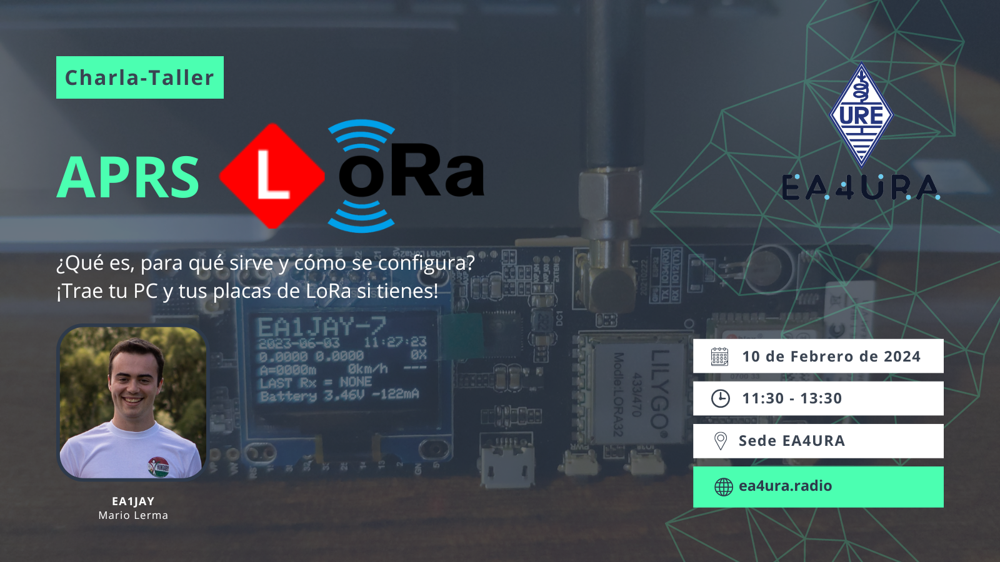

Este sábado **10 de febrero de 2024** estaré en la sede de [EA4URA](https://ea4ura.radio/contacto/) dando una charla-taller sobre como iniciarse en el mundo de APRS LoRa, para todos aquellos interesados en esta nueva modalidad tan curiosa, en la que implementamos modulaciones de espectro ensanchado en nuestro hobby.

Y es verdaderamente sorprendente las coberturas que se pueden llegar a dar con tan solo 100 mW. A continuación podéis ver un DX  de más de 800km del 29 de enero entre un digipeater de Alicante y un igate del suroeste de Córcega:


 
<blockquote class="twitter-tweet" data-theme="light">
LoRa/APRS et propag. UHF: La modulation LoRa est absolument siderante en terme d&#39;efficacité, surtout par temps de bonne propagation tropospherique. Ex d&#39;un repeteur Espagnol de la Communidad Valenciana reçu en Sud Corse a plus de 800km a vol d&#39;oiseau. Pwr = 100mW ! F=433.775 MHz <a href="https://t.co/94IBCDVZYR">pic.twitter.com/94IBCDVZYR</a>
&mdash; F5OPV (@F5OPV) <a href="https://twitter.com/F5OPV/status/1751973526376980804?ref_src=twsrc%5Etfw">January 29, 2024</a></blockquote>  



**No hace falta tener ningún conocimiento de APRS ni de LoRa para asistir a la charla**, se empezará con los conceptos básicos para que todo el mundo partamos de la misma base. Mi idea es que la parte de la charla no sea muy extensa y podamos pasar rápido a la parte de taller, donde podremos configurar los dispositivos de LoRa, si los tenéis, para que podáis probar este curioso modo. ¡No olvides traer tu portátil!

Si quieres fisgar un poco qué estaciones hay en EA o en todo el mundo exclusivamente de APRS LoRa puedes visitar: [https://map.lora-aprs.es](https://map.lora-aprs.es)

[Info de la charla y dónde comprar los módulos en la web de EA4URA](https://ea4ura.radio/charla-lora-por-ea1jay-mario/)

A continuación tenéis el cartel de la charla:

