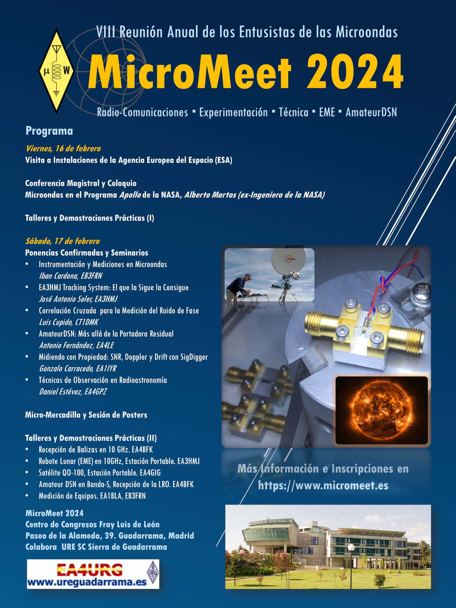
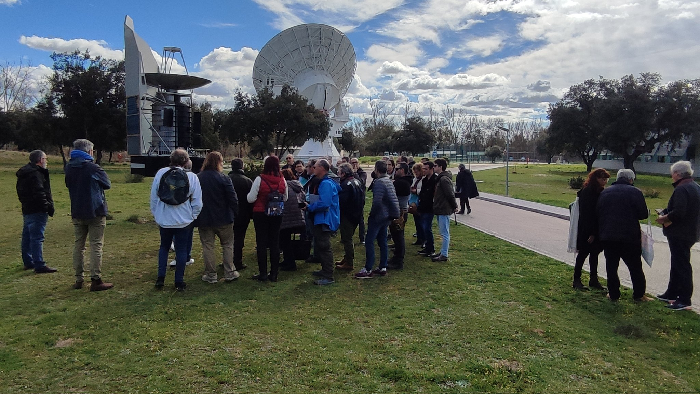
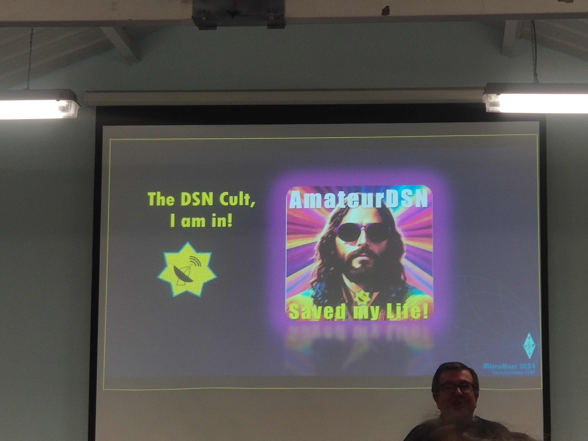
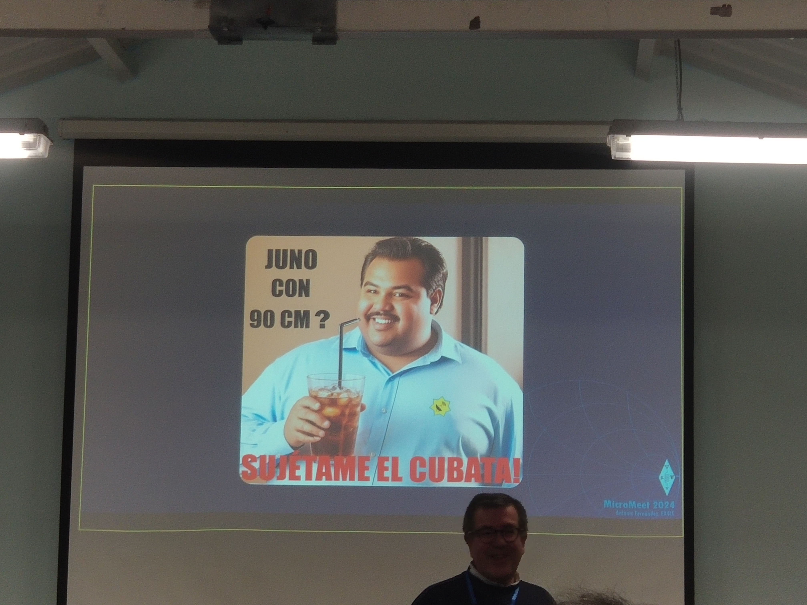

## Intro

Pues resulta que por algún grupo me llegó el siguiente cartel a principios de Diciembre: 

Y claro... leyendo uno el programa no había otra opción que no fuera apuntarse jejeje.

La verdad que hice bien en apuntarme lo antes posible, porque las plazas para la visita a ESAC volaron, y realmente mereció la pena.

Según se acercaba la fecha empecé a insistir en el radioclub de la uni (EA4RCT, Radioclub de la ETSIT UPM) para ver a cuantos engañaba para que se vinieran. Para nosotros tenía esa ventaja, que nos pillaba en la Comunidad de Madrid y había varias opciones de transporte para llegar. ¡Pues al final nos apuntamos 10 personas! ¡Invasión de chavales universitarios!

## Viernes 16 de Febrero

Arranca el día prontito por la mañana para recoger a EA4HQF Santi e ir rumbo a Villafranca del Castillo. Encendemos APRS y al lío.

### Sesión de Mañana

Al llegar ya nos vamos encontrando caras conocidas: EA4BFK Alex organizando a los recién llegados, EA1Q Tomás junto con otros colegas de Valladolid (EA1RJ Ricardo y EA1FAQ David), EA2AZW Abilio, EA4DEI Javier & XYL junto con EA4FXZ Fran y algún compañero más que seguro que se me está escapando. Como dice Tomás, entre el "ponte bien, estate quieto..." pues aprovechamos a ponernos al día antes de comenzar la visita.

Como una imagen (o varias, no voy a ser malo) vale más que mil palabras, allá vamos:

   

  

Una vez terminada la visita, hora de comer. Unos cuantos platos y muchas risas después, comenzamos la sesión de tarde.

### Sesión de Tarde

Al llegar al Centro de Congresos Fray Luis de León ya nos estaba esperando Alberto Martos (ex-ingeniero de la NASA en Robledo de Chavela). 

Esa tarde nos transportamos unos cuantos años atrás, a cuando lo de ordenador portátil sonaba a romperse la espalda. Fueron millones de anécdotas y detalles, que, para no hacer spoiler, os dejo su presentación para que la veais porque fue una verdadera pasada:



Siendo ya hora de cenar y con las cabezas orbitando el espacio profundo, terminamos el primer día con muchas ganas del segundo.

## Sábado 17 de Febrero

Hora de recoger a la chavalería, APRS y nos ponemos en marcha. 

Nos juntamos en Ciudad Universitaria la primera tanda (Javi (EA4 en proceso), Paulina, EA4HQF Santi y un servidor) e iniciamos ruta, mientras el resto recogían unas partes de un proyecto en curso del radioclub para probarlas allí.

"¿Oye esto dónde es?" Pues nada, a buscar a los que se habían perdido... Por suerte no estaban muy lejos ~~(no sabían leer jajaja)~~

De nuevo, no quiero hacer spoiler de las charlas que hubo, solamente decir que es una pasada la cantidad de horas de trabajo, esfuerzo y documentación que tienen detrás los ponentes para estar a esa altura de nivel de conocimientos. Lo resumiría con 2 palabras: ¡envidia sana! 

¿Lo *malo*? Que miraras a donde miraras había cacharros que daban ganas de comprar 3 de cada por lo menos.

Y desde luego risas no faltaron. Un crack EA4LE Antonio con estas diapositivas jajajaja:

Ahora sí, no me hago más extenso. Os dejo el vídeo de la sesión del Sábado:



Alguno culminó el día comprando cosillas en el mercadillo, pero la verdad que fue un fin de semana fantástico. Está claro que el año que viene volvemos a caer por aquí seguro jejeje.

Mis felicitaciones personales a la sección de URE Guadarrama por toda la organización y por supuesto a todos los ponentes e involucrados en que el evento saliera redondo. 

¡Nos vemos el año que viene!